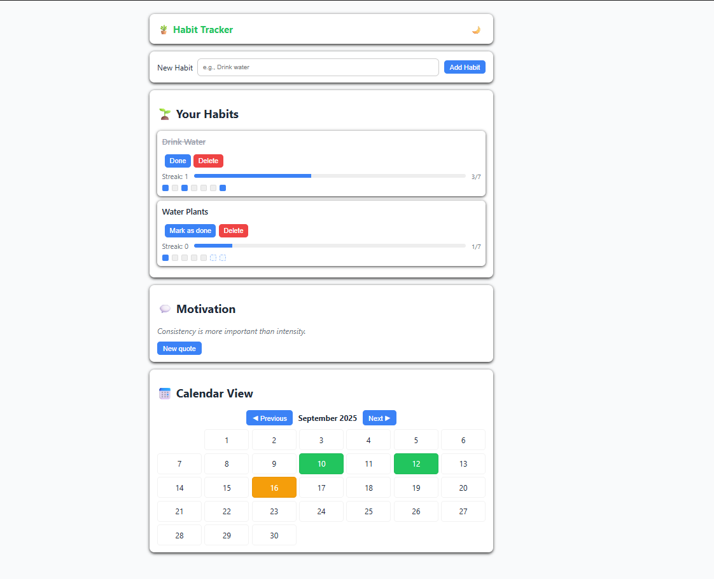
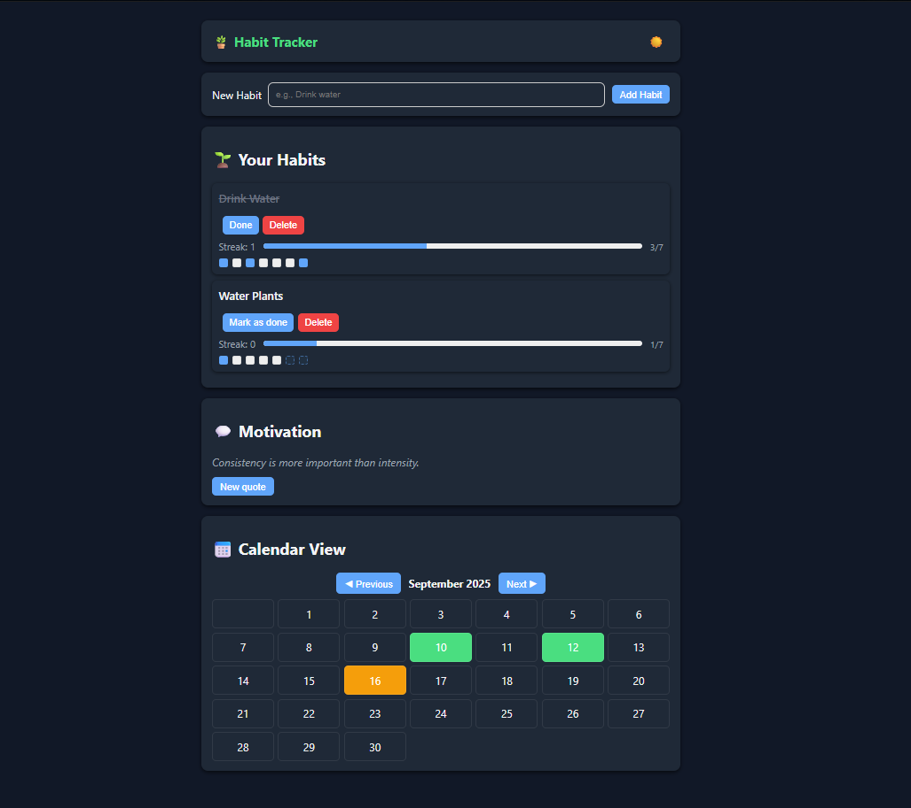

# 🪴 Habit Tracker

A simple, modern Habit Tracker web app built with **HTML, CSS, and JavaScript**. Track your daily habits, monitor streaks, and visualize progress with a mini weekly and monthly calendar. Supports **light/dark mode** and motivational quotes to keep you consistent.

---

## Features 

- **Add & Delete Habits:** Quickly create new habits and remove completed or irrelevant ones.
- **Mark Habits as Done:** Track daily completion with a single click.
- **Streak Counter & Progress Bar:** Visual indicator for last 7 days and consecutive streaks.
- **Mini 7-Day Calendar:** See weekly completion at a glance.
- **Monthly Aggregated Calendar:** View progress across all habits with full/partial completion highlights.
- **Theme Toggle:** Switch between light and dark modes.
- **Motivational Quotes:** Stay inspired with randomly displayed quotes.
- **Tooltip Details:** Hover over calendar days for detailed habit status.
- **Local Storage:** Habits persist between sessions.

---

## Demo




---

## Installation & Usage

1. **Clone the repository:**
    ```bash
    git clone https://github.com/YasOnline177/habit-tracker.git
    cd habit-tracker
    ```
2. Open `index.html` in your browser. 
3. Start tracking habits and enjoy your progress!

---

## Technologies Used

- HTML
- CSS
- JavaScript 

---

## Author

**Yasara Samaraweera**
    - Github: [YasOnline177](https://github.com/YasOnline177)
    - Email: yasarasamaraweera@gmail.com